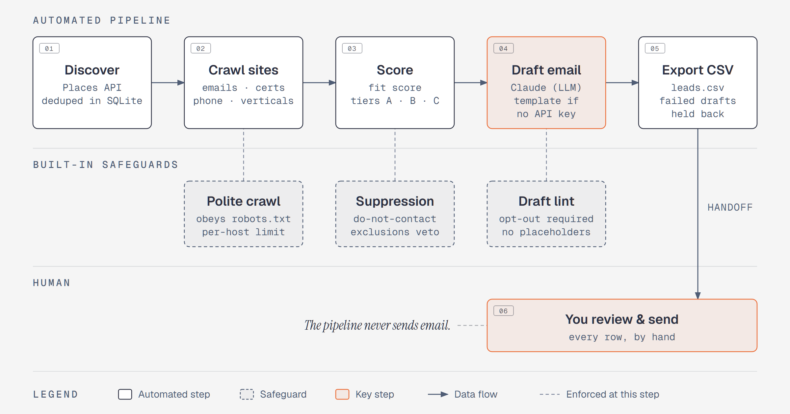

# Maps lead pipeline

## Problem

Build a qualified B2B prospect list of local trade companies in a chosen sector and region (the example config uses roofing, plumbing, electrical and painting). Each company needs a verified contact email, a few quality signals, a priority score and a short first email ready for a human to review. The pipeline does the finding, crawling, scoring and drafting. Sending stays manual.

## How it works

<picture>
  <source media="(prefers-color-scheme: dark)" srcset="docs/diagram-dark.png">
  
</picture>

1. **Discover.** Each vertical × city pair becomes a search query (`config/verticals.yml` × `config/regions.yml`). The official Google Places API is the default source. An opt-in Playwright scraper for the Google Maps results feed covers what the API misses. That source is off by default (`LEADS_MAPS_ENABLED=true` turns it on) and is a technique demo: use it only in line with Google's terms of service. The Places API is the supported path.
2. **Dedupe.** Every hit is upserted into SQLite and matched on *any* shared identifier: domain, normalised phone, or name + postcode. The same company found twice ends up as one row.
3. **Enrich.** A polite async crawler fetches the homepage plus contact/about pages. It extracts emails (including obfuscated ones), certifications, served verticals and a phone number, and flags wrong-segment companies.
4. **Score.** A fit score (email, vertical match, certs, Google rating × review count, real address + phone, priority region) produces tiers A/B/C. Exclusion and do-not-contact lists veto outreach.
5. **Draft.** Claude drafts a short, neutral introduction email per company from `config/email_prompt.md`, with an offline template drafter as fallback. A lint blocks drafts with unfilled placeholders, emoji or a missing opt-out.
6. **Export.** Only clean drafts go into a CSV for human review. Cells are defused against spreadsheet formula injection.

## Playwright techniques

(Maps source: `src/scraper/browser.py`, `src/discovery/google_maps_html.py`. Off by default and included as a demo; use it only in line with Google's terms. The Places API is the supported discovery path.)

- Uses Patchright, a drop-in Playwright fork, with `launch_persistent_context` on the real Chrome channel. For resilience it runs a realistic, stable browser profile: a persistent profile directory, `headless=False`, `no_viewport=True`, and no UA, locale or viewport overrides. Chrome's own settings are self-consistent, while overrides make them drift.
- An async context manager owns the browser lifecycle, and the import is lazy so the rest of the pipeline runs without a browser installed.
- Challenge detection: reads `inner_text("body")` for challenge-page markers and raises `ChallengeDetected`. The adapter then abandons that query and returns no results; it does not retry.
- Infinite-scroll harvesting: `eval_on_selector('div[role="feed"]', "el => el.scrollTop = el.scrollHeight")` in a bounded loop with jittered pauses, then `query_selector_all` over the place links, reading `aria-label` and `href`.
- Human-ish pacing via `jittered_delay` (base ± jitter, with a floor).
- Opt-in gate: the Maps source does nothing unless `LEADS_MAPS_ENABLED=true`, and queries run one at a time.

The HTTP crawler (`src/net/`) handles the website crawl without a browser. It caches robots.txt per origin and honours both `Disallow` and `Crawl-delay`, with conservative handling of failures in line with RFC 9309. Redirects are followed for up to 5 hops. A 401/403 response, any 5xx, a network error or too many redirects all count as "disallow all", and any other 4xx counts as "no rules". Enabling the Maps source does not change any of this. Requests go through `retry_with_backoff` (`src/scraper/retry.py`): exponential backoff with jitter, where timeouts and 500/502/503/504 responses are retried, while 401/403/429, captcha pages, robots disallows and blocked targets are never retried. It rate-limits per host with a global concurrency cap, follows redirects manually so every hop is revalidated, and has an SSRF guard that refuses hosts resolving to private or loopback addresses.

## How AI was used

I built this with Claude Code. The source project has a `CLAUDE.md` that sets the invariants the agent had to respect: never auto-send, robots.txt on every crawl, the Places API as the primary source, and suppression always vetoing outreach. 23 of its 32 commits carry `Co-Authored-By: Claude`. After a structured code review, the findings were fixed one PR at a time, and the reasoning is kept in the code comments. Examples are per-hop redirect revalidation, the per-host rate limiter lock ordering, the bounded obfuscation regex and CSV formula defusing. The drafting stage uses the Anthropic API at runtime, with prompt caching on the system prompt. For this portfolio version, Claude helped strip the project down to a generic, runnable core. I checked it with the offline smoke test and with a real patchright run of the Maps adapter against a routed mock page.

## Build time

The first version took **about a week, about 5.5 hours hands-on**. After that came roughly 10 weeks of occasional hardening (32 commits in total), including a dashboard that is not part of this extract.

Measured from my Claude Code prompt history, git commits and file timestamps. "Hands-on" counts the time I spent prompting; Claude often kept working autonomously after that.

## Run it

```bash
python -m venv .venv && . .venv/bin/activate      # Windows: .venv\Scripts\activate
pip install -r requirements.txt
patchright install chrome                         # only for --source maps
cp .env.example .env                              # fill in keys + sender identity

python scripts/smoke_test.py                      # offline proof: no network, no keys

python src/main.py run --vertical plumbing --region springfield --limit 2
# or stage by stage:
python src/main.py discover --vertical all --region region-a --source places
python src/main.py enrich
python src/main.py score
python src/main.py draft --tier A
python src/main.py export --out data/leads.csv --tier A
python src/main.py stats
```

Environment (see `.env.example`):

| Var | Purpose |
|---|---|
| `GOOGLE_MAPS_API_KEY` | Places API (New). Required for the default `places` source |
| `ANTHROPIC_API_KEY` | LLM drafting. When empty, the template drafter is used |
| `LEADS_SENDER_NAME` / `_ROLE` / `_COMPANY` / `_EMAIL` / `_PHONE` | Sign-off identity. Export is blocked while the name is unset |
| `LEADS_MAPS_ENABLED` | `true` opts in to `--source maps` (default off). Does not affect robots.txt for the website crawl |
| `LEADS_RESPECT_ROBOTS` | robots.txt enforcement for the website crawl (default `true`; leave it on) |
| `LEADS_*` | Any other field in `src/config.py` (delays, concurrency, model, thresholds) |

## Privacy and cold-email rules

The crawl collects business contact details from public websites, which can include named people's addresses: the `all_emails` column lists every address found, not only the chosen role mailbox. Treat the database and CSV as personal data under GDPR. Keep them local, limit retention, and honour the do-not-contact list (`config/suppression.csv`). Cold B2B email is regulated differently per country (GDPR plus local anti-spam law), so check the rules for your market and review every draft and recipient before sending. The tool never sends email. It only produces drafts for a human to review, prefers role mailboxes (`info@`) over personal ones, and blocks export of any draft without an opt-out line.

The example config targets the Dutch market: phone normalisation assumes `+31`, and some contact-page slugs and role-mailbox names are Dutch.

## Files

| File | Description |
|---|---|
| `src/main.py` | CLI: `discover`, `enrich`, `score`, `draft`, `export`, `run`, `stats` |
| `src/pipeline.py` | Stage orchestration, search-task building, bounded concurrency |
| `src/config.py` | `pydantic-settings` config (env + `.env`), sender sign-off block |
| `src/models.py` | Pydantic models: `RawCandidate`, `Company`, `EmailHit`, CSV row shape |
| `src/db.py` | SQLite store: upsert that merges on any shared identifier, pinned record keys |
| `src/dedup.py` | Registrable domain, phone normalisation, identity keys, record merge |
| `src/loaders.py` | YAML/CSV config loaders |
| `src/score.py` | Fit score, priority tier, exclusions and suppression |
| `src/scraper/browser.py` | Patchright/Playwright persistent Chrome session + challenge check |
| `src/scraper/retry.py` | Backoff with jitter, retryable-error classifier, `ChallengeDetected` |
| `src/scraper/timing.py` | Jittered delay |
| `src/discovery/base.py` | `SearchTask` + `DiscoverySource` interface |
| `src/discovery/google_places.py` | Places API (New) text search with pagination and field mask |
| `src/discovery/google_maps_html.py` | Opt-in browser scraper for the Maps results feed (name + place link) |
| `src/net/http.py` | Async HTTP client: robots, Crawl-delay, per-hop redirect checks, retry |
| `src/net/ratelimit.py` | Per-host rate limiter with a global concurrency cap |
| `src/net/robots.py` | Cached robots.txt parser (`can_fetch`, `crawl_delay`) |
| `src/net/guard.py` | SSRF guard: public http(s) targets only |
| `src/enrich/website.py` | Crawl homepage + contact pages, fill in emails, certs, verticals, phone |
| `src/enrich/email_extract.py` | Email extraction (mailto, plain, obfuscated), role-vs-personal ranking |
| `src/enrich/vertical_match.py` | Vertical keyword match and wrong-segment veto |
| `src/enrich/cert_detect.py` | Certification patterns |
| `src/outreach/draft.py` | Claude drafter (prompt caching, retry ladder) + template fallback, A/B subjects |
| `src/outreach/lint.py` | Draft lint: placeholders, emoji, opt-out |
| `src/outreach/export.py` | Review CSV with formula-injection defusing |
| `config/*.yml`, `config/email_prompt.md`, `config/suppression.csv` | Example verticals, regions, exclusions, prompt, do-not-contact list |
| `scripts/smoke_test.py` | Offline end-to-end check through dedup, enrich, score, draft, lint and export |
| `requirements.txt`, `.env.example`, `.gitignore` | Dependencies, empty env template, ignores for data, logs, profiles and `.env` |
